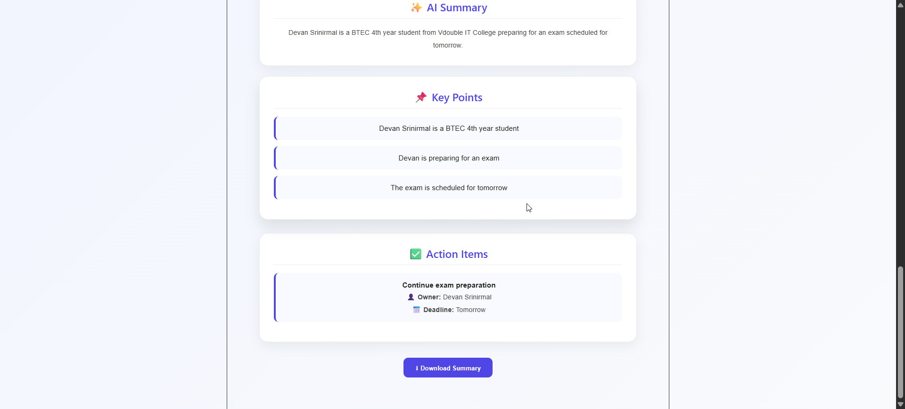
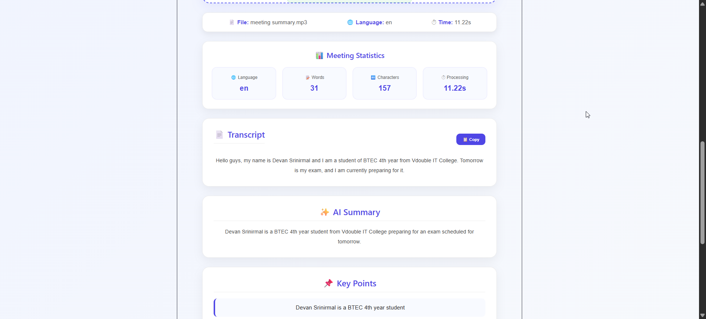
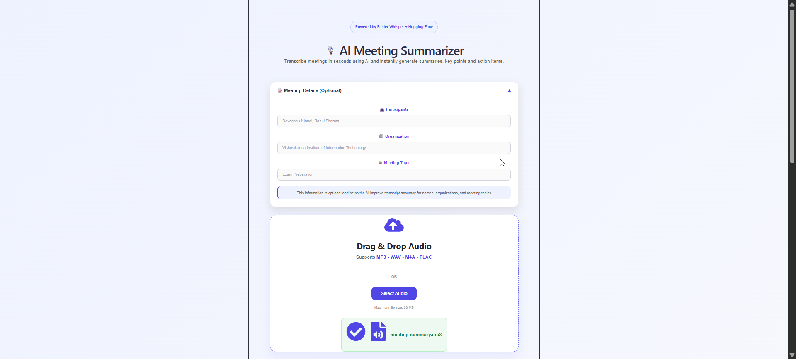

# 🎙️ AI Meeting Summarizer

<p align="center">

An AI-powered Meeting Summarizer that converts meeting recordings into structured meeting notes using <b>Faster Whisper</b> and <b>Large Language Models (LLMs)</b>.

Automatically generates:
- 📝 Accurate Transcripts
- ✨ AI-Corrected Transcripts
- 📄 Meeting Summaries
- 📌 Key Discussion Points
- ✅ Action Items

## 🚀 Live Demo

Frontend:
https://meeting-summarizer-pi-xxxx.vercel.app

</p>

---

## 📸 Application Preview

### 🏠 Home Page



---

### 🎤 Upload Audio



---

### 📄 Generated Results



---

# ✨ Features

- 🎤 Speech-to-Text using Faster Whisper
- 🤖 AI-based Transcript Correction
- 📝 Automatic Meeting Summaries
- 📌 Key Point Extraction
- ✅ Action Item Detection
- 🌍 Automatic Language Detection
- 📥 Download Meeting Summary
- 📋 Copy Transcript
- ⚡ Fast React Interface
- 🎯 Meeting Context Support (Participants, Organization & Topic)

---

# 🏗️ System Architecture

```text
                 Audio File
                      │
                      ▼
        Faster Whisper (Python)
                      │
             Raw Transcript
                      │
                      ▼
      Hugging Face LLM (Correction)
                      │
        Corrected Transcript
                      │
                      ▼
        Hugging Face LLM (Summary)
                      │
                      ▼
     Summary • Key Points • Action Items
                      │
                      ▼
            React + Express Dashboard
```

---

# 🛠️ Tech Stack

## Frontend

- React
- Vite
- CSS3
- Axios
- React Dropzone

---

## Backend

- Node.js
- Express.js
- Multer

---

## AI & Machine Learning

- Faster Whisper
- Hugging Face Router API
- Qwen 2.5 Instruct

---

## Python

- Faster Whisper
- Torch

---

# 📂 Project Structure

```text
Meeting-Summarizer

│

├── backend
│   ├── controllers
│   ├── middleware
│   ├── routes
│   ├── services
│   └── app.js
│
├── frontend
│   ├── public
│   ├── src
│   └── package.json
│
├── transcriber
│   ├── app.py
│   ├── transcribe.py
│   └── requirements.txt
│
└── screenshots
```

---

# 🚀 Getting Started

## 1️⃣ Clone the Repository

```bash
git clone https://github.com/devaa57/Meeting-Summarizer.git
```

---

## 2️⃣ Backend

```bash
cd backend

npm install
```

Create a `.env` file:

```env
HF_API_KEY=your_huggingface_api_key
PORT=5000
PYTHON_PATH=path_to_python
```

Start the backend:

```bash
npm start
```

---

## 3️⃣ Frontend

```bash
cd frontend

npm install

npm run dev
```

---

## 4️⃣ Python Transcriber

```bash
cd transcriber

pip install -r requirements.txt
```

Run the transcription service according to your setup.

---

# 📌 Workflow

1. Upload an audio recording.
2. Faster Whisper transcribes the audio.
3. AI corrects grammar and transcription errors.
4. AI generates:
   - Meeting Summary
   - Key Points
   - Action Items
5. Results are displayed in the dashboard.
6. Download the generated meeting summary.

---

# 🚀 Future Improvements

- 📄 PDF Export
- 👥 Speaker Diarization
- ⏱️ Timestamped Transcripts
- 🔍 Transcript Search
- 🌙 Dark Mode
- ☁️ Cloud Deployment
- 📊 Meeting Analytics Dashboard

---

# 👨‍💻 Author

**Devanshu Nirmal**

GitHub:
https://github.com/devaa57

---

# ⭐ Support

If you found this project useful, consider giving it a ⭐ on GitHub.
